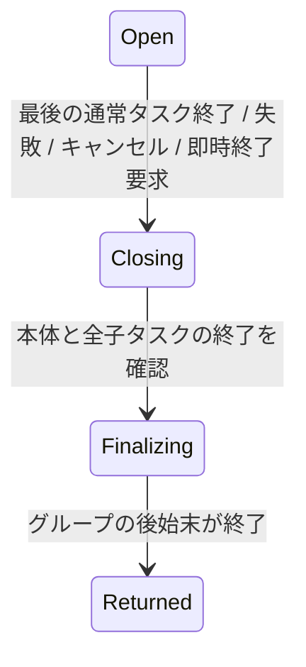

# TaskGroup のモデル検査

[English](README.md)

`moonbitlang/async@0.21.3` の TaskGroup を題材に、**子タスク2個とグループ本体**を
有限状態にモデル化する。実行する状態遷移と `moon prove` の定義を共有し、Z3 で
時相性質の反例を探索する。実際の async 実装との対応は、実行履歴を採取するテストで確認する。
この例は `mizchi/veri-examples/task_group` にあり、公開済みライブラリの汎用 TaskGroup API ではない。

## 実行

リポジトリ直下で実行する。MoonBit、Node.js 24以上、Z3、just が必要。
Why3 は既存の `~/.moon/share/why3` を使い、証明用 CVC5 の準備は just の依存レシピが行う。
async は examples モジュールだけに追加している。

```sh
just prove-task-group   # 本体・利用側を通常/機械整数の両モデルで証明
just task-group         # 遷移表の生成、11種類の SMT 検査、MoonBit での反例再生
just test-task-group    # 全探索との照合、shrinking 付き QuickCheck、実際の async
just verify-task-group # 上記と、偽の契約が証明されないことの検査
```

通常の証明コマンドも使える。

```sh
moon -C examples prove task_group
moon -C examples prove task_group/client
```

## 状態とイベント

契約の基準は [v0.21.3 の TaskGroup の実装と API コメント](https://github.com/moonbitlang/async/blob/v0.21.3/src/task_group.mbt)。
最新版の未リリース API に依存しない。



`Returned` は `with_task_group` から抜けた状態を表し、エラーやキャンセルで抜ける場合も含む。
`failed` は通常のエラー、`cancel_requested` は外部からのグループキャンセル要求を記録する。
成功値や複数のエラー間の優先順位は扱わない。`return_immediately` は外部キャンセルと区別する。

| 対象 | 状態・意味 |
| --- | --- |
| グループ本体 | `Running` → `Finished`、または `CancelRequested` → `Finished` |
| 子タスク | `Absent` → `Active` → `Completing` / `Failing` / `Cancelling` → `Done` |
| リソース | 子が持つ概念上のリソースを `Cleanup` で解放する |
| 設定 | 各子の `no_wait` と `allow_failure`。実行列全体で固定する |

- `BodyReturn` だけでは、通常の子タスクが残っているグループは終了しない。
- `no_wait=true` の子は、最後の待機対象タスクが終了したらキャンセルされる。その子の終了も待つ。
- 子の `Fail` では、ユーザーの後始末が完了してから失敗がグループに伝播する。
- `allow_failure=true` の子の失敗や `Task::cancel` は、それだけでは兄弟を失敗させない。
- `ReturnImmediately` と `CancelGroup` は終了要求。残る本体・子の後始末を経て `Join` する。
- キャンセル中でも既存タスクが残る間は未使用の子スロットに `Spawn` でき、その子は最初からキャンセル状態になる。
- `Join` 後はグループの defer を実行する。そこでの `Spawn` はモデルでは拒否する。実 API では禁止操作として abort する。

## MoonBit からの利用

例のモデルを import したテストでは、状態を明示的に渡す。

```moonbit
let policy = @task_group.default_policy()
let state = @task_group.initial()
let running = @task_group.step(policy, state, Spawn(First)).unwrap()
let closing = @task_group.step(policy, running, CancelGroup).unwrap()

// キャンセルを要求しただけなので、まだ終了できない。
assert_eq(@task_group.step(policy, closing, Join), None)
```

利用側の契約は `valid_state`・`safe_outcome`・`step_result` を使う。
[client](../../examples/task_group/client/client.mbt) は、別パッケージから実際に証明する例。
実装は [型](../../examples/task_group/types.mbt)、
[純粋な遷移定義](../../examples/task_group/model.mbt)、
[契約付き API](../../examples/task_group/api.mbt)、
[述語と補題](../../examples/task_group/model.mbtp) に分けている。

## 時相検査の読み方

| 検査 | 期待結果 |
| --- | --- |
| 安全性 | 深さ8まで反例なし。別途 `moon prove` で帰納的にも証明 |
| 成功終了・エラー終了への到達 | どちらも実行列が存在する |
| `G(closing => F returned)`、公平性なし | 終了処理を進めず待ち続ける反例 |
| 同じ性質、弱公平性あり | 深さ8まで反例なし |
| `G(body_done => F returned)`、同じ公平性 | 通常の子が I/O 待ちなら終了しない反例 |
| `no_wait` / `allow_failure` と公平性 | 終了要求後の応答性に深さ8まで反例なし |
| 壊した Join | 本体や子が残ったままグループの後始末に進む反例 |
| 壊した Cleanup | 終了した子がリソースを保持する反例 |
| 壊したキャンセル通知 | 公平な実行でも終了できない反例 |

公平性は、各子の `Cleanup`、本体の `BodyCancelled`、`Join`、`FinishDefers` が
継続して実行可能なら、いつか実行されるという仮定。ループごとに各アクションが無効な状態、
または実際に状態を変える実行があることを要求する。
**任意の子の I/O が完了することは仮定しない。** 後始末自体が永久に待つ場合も、
この公平性の仮定を満たさないため、終了保証の対象にならない。

SMT 検査は深さ1～8の lasso（有限の前半と繰り返すループ）を探索する。
安全性・到達性では深さ0の初期状態も調べる。終了状態での stuttering を許す。
この上限での反例なしを、無制限の活性証明とは扱わない。`unknown` やソルバのエラーは検査失敗にする。

結果は `_build/task-group/report.json`、モデルは `model-*.json`、制約は `*.smt2` に保存する。
反例には状態番号とイベント名を含める。故障モデルの反例は**意図的に注入した不具合**を示し、
`moonbitlang/async` の既知のバグを示すものではない。

## Apalache との照合

```sh
just apalache # Nix で版を固定した Apalache 0.62.2 と Java 21 を用意
```

上記の11検査を Apalache と Z3 の両方で実行し、さらに
[Job 仕様](../temporal/README.ja.md#任意の-apalache-バックエンド)の4検査を行う。
Nix の導入は任意で、公開ライブラリの依存関係には追加しない。Docker は不要。

TLA+ は **MoonBit が出力した同じ遷移表**から生成する。状態番号の整数と、直前に実行した
アクションを記録する変数を持つ。同じ始点・終点を持つ別のイベントも区別できる。
`Next` は `Tick` を含め、実行可能なすべての遷移を保存する。
公平性のガードも遷移表から求め、状態を変えない遷移を除外する。
弱公平性は `[]<>~Enabled \/ []<><<Taken>>_vars` に展開する。

安全性は `--inv`、到達性は「目的状態でない」という不変条件への反例で検査する。
応答性は `--temporal` を使い、時相式の変換は Apalache が行う。
ITF 形式の反例を状態・イベントの番号へ戻し、保存されたループ開始点も確認して、
既存の時相評価器と MoonBit の driver で再検査する。Z3 が別途見つけた実行列も再生する。

両ツールの探索上限は深さ8。ただしアクションを記録する変数や Apalache の時相用の
補助変数により、反例の表現に必要な長さが増えることがある。
最短反例の長さや完全性を保証する上限が等しいとは扱わない。
結果の一致から無制限の活性証明を導くこともしない。
遷移表の出力と TLA+ 生成はテストの対象で、`moon prove` の証明範囲外。

結果・イベント列・出力先は `_build/apalache/report.json` に記録する。
実行ごとの新しいディレクトリへ遷移表・`FiniteModel.tla`・SMT 制約・元の ITF を保存する。
エラー・タイムアウト・不正な反例はコマンドの失敗とする。
Apalache は任意で、`just verify-task-group` の依存には含めない。

## 実行時との対応と保証範囲

[async のテスト](../../examples/task_group/runtime/runtime_test.mbt) は、本物の `spawn`・
`with_task_group`・`Task::cancel`・`return_immediately`・`add_defer` を動かす。
子タスクは容量1のキューで待機し、開始確認を受け取ってから完了・失敗・キャンセルを指示する。
通常終了、no_wait、失敗、許容された失敗、手動キャンセル、即時終了、外部キャンセル、
本体の失敗、グループ defer の失敗の9種類を、子の生成順を入れ替えて検査する。
子のリソース解放、グループ defer の実行順、実際の終了理由も確認する。
タイミング調整の sleep は使わず、5秒の制限はテスト停止用の watchdog とする。

- 純粋なモデルの初期状態・遷移・任意長の有限実行列の安全性は `moon prove` の対象。
- 全16設定の到達状態と全遷移を、独立した命令的な実装と照合する。
- 1,000件の QuickCheck ではイベント列を生成し、標準の配列・tuple shrinking を使う。
- SMT の符号化は、小さなグラフの全実行列・ループの直接評価と照合する。
- SMT の反例は、エクスポートした表を使わず MoonBit の遷移関数を呼び直して検査する。
  不正な状態・イベント・ループ・公平性・故障モデルの取り違えも拒否する。
- JSON 入出力、有限状態の列挙、SMT 生成、時相評価器、async 側の観測処理はテスト済みで、未証明。

実 async のテストは選んだ実行履歴がモデルに従うことを確認する。ソルバが返した任意の
実行順序を実ランタイムで強制するスケジューラや、全 async 実行とモデルの対応証明はまだない。
モデルは実装より細かく後始末の前後を分けており、実ランタイムでは割り込めない順序も許しうる。

対象は1グループ・再利用しない子スロット2個・本体。通常の子タスク内の詳細な await 位置、
任意個数のタスク、入れ子グループ、`spawn_loop`、グループ終了処理中の追加の外部キャンセル、
子の cleanup 自体の失敗、キャンセル保護中の非同期 defer の内部、実時間・タイマー、チャネルの一般的な意味論は未対象。
リソース解放はこの例のワーカーに課した契約で、TaskGroup が任意のユーザー資源を自動解放するという意味ではない。
