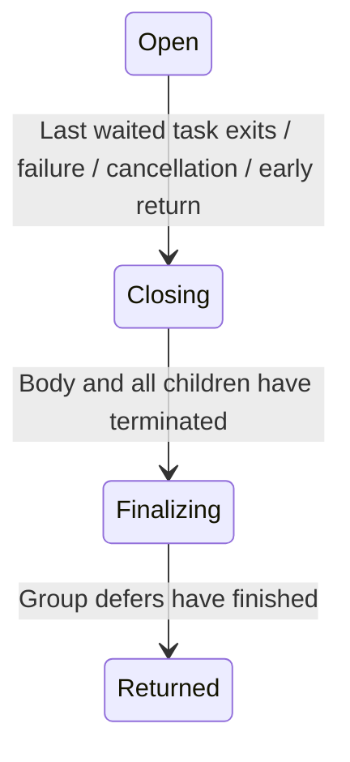

# TaskGroup model checking

[日本語](README.ja.md)

This example models **two child tasks and the group body** of
`moonbitlang/async@0.21.3`. Execution and `moon prove` share a pure transition
definition. Z3 searches for temporal counterexamples, and tests compare observed
traces from the actual async runtime with the model. It lives in
`mizchi/veri-examples/task_group`; it is not a published general-purpose TaskGroup API.

## Run

Run from the repository root with MoonBit, Node.js 24+, Z3 and just installed.
Proof recipes use the existing `~/.moon/share/why3` setup and prepare CVC5.
Only the examples module depends on async.

```sh
just prove-task-group   # Prove model and client with both integer preludes
just task-group         # Export, run 11 SMT checks, replay witnesses in MoonBit
just test-task-group    # Reference checks, shrinking QuickCheck, real async tests
just verify-task-group # All of the above, plus a negative proof control
```

Ordinary proof commands also work:

```sh
moon -C examples prove task_group
moon -C examples prove task_group/client
```

## Model

The behavioral reference is the
[v0.21.3 implementation and API comments](https://github.com/moonbitlang/async/blob/v0.21.3/src/task_group.mbt),
not unreleased API changes on the default branch.



`Returned` means `with_task_group` has exited, including exceptional and cancelled
exits. `failed` records ordinary failure; `cancel_requested` records external
group cancellation. Result values and precedence between competing errors are
not modeled. Successful `return_immediately` is distinct from external cancellation.

| Component | Representation |
| --- | --- |
| Body | `Running` → `Finished`, or `CancelRequested` → `Finished` |
| Child | `Absent` → `Active` → `Completing` / `Failing` / `Cancelling` → `Done` |
| Resource | A conceptual per-child resource released by `Cleanup` |
| Policy | Per-child `no_wait` and `allow_failure`, fixed throughout a trace |

Returning from the body still waits for ordinary children. Once the last waited
task finishes, remaining `no_wait` children are cancelled **and joined**. Child
failure propagates after its user cleanup; `allow_failure` isolates that failure.
Manual task cancellation alone does not fail siblings. `ReturnImmediately` and
`CancelGroup` request termination; cleanup and joining must still follow.

While cancellation is in progress and existing tasks remain, an unused child
slot may be spawned, but starts cancelled. Spawning during group defers or after
exit is rejected by the model; the real API aborts on those forbidden operations.

## MoonBit use

In a test importing the example model:

```moonbit
let policy = @task_group.default_policy()
let state = @task_group.initial()
let running = @task_group.step(policy, state, Spawn(First)).unwrap()
let closing = @task_group.step(policy, running, CancelGroup).unwrap()

// Cancellation was requested, but the group cannot exit yet.
assert_eq(@task_group.step(policy, closing, Join), None)
```

Contracts consume `valid_state`, `safe_outcome` and `step_result`; see the proved
[cross-package client](../../examples/task_group/client/client.mbt).
[Types](../../examples/task_group/types.mbt),
[pure transitions](../../examples/task_group/model.mbt),
[contracted API](../../examples/task_group/api.mbt), and
[predicates/lemmas](../../examples/task_group/model.mbtp) are separate files.

## Reading results

| Check | Expected result |
| --- | --- |
| Safety | No counterexample through depth 8; also proved inductively with `moon prove` |
| Successful and failed exit reachability | Both have witnesses |
| `G(closing => F returned)`, no fairness | Counterexample that never advances termination |
| Same property with weak fairness | No counterexample through depth 8 |
| `G(body_done => F returned)`, same fairness | Counterexample with an ordinary child blocked on I/O |
| `no_wait` / `allow_failure` and fairness | No closing-response counterexample through depth 8 |
| Broken Join | Group defers begin while body or children remain |
| Broken Cleanup | A terminated child still holds its resource |
| Lost cancellation notification | Termination can stall even with the stated fairness |

Weak fairness applies separately to each child's `Cleanup`, `BodyCancelled`,
`Join`, and `FinishDefers`: a continuously enabled action must eventually execute.
Each repeated loop must either disable that action somewhere or execute a
state-changing instance. **Arbitrary child I/O is not assumed to complete.**
Permanently blocked cleanup does not satisfy the fairness assumption either.

Response queries search lassos at depths 1–8; safety and reachability also check
depth 0. Terminal states allow stuttering. Absence of a counterexample at this
bound is not reported as an unbounded liveness proof. Unknown solver results,
errors and timeouts fail the check.

Artifacts are written under `_build/task-group/`: `report.json`, `model-*.json`,
and per-query `*.smt2` files. Reports include state identifiers and event names.
Fault variants are intentionally broken models, **not discovered bugs in
moonbitlang/async**.

## Apalache cross-check

```sh
just apalache # Nix installs pinned Apalache 0.62.2 and Java 21
```

This runs the 11 checks above with both Apalache and Z3, plus four checks of the
[Job specification](../temporal/README.md#optional-apalache-backend). The optional
Nix setup does not change the published library dependencies or require Docker.

The TLA+ source is generated from the **same transition table exported by
MoonBit**. It has an integer state ID and a variable recording the incoming
action. Recording actions distinguishes different events with identical
endpoints. `Next` preserves every enabled edge, including `Tick`. The enabling
condition for each fair action comes from that table and excludes self steps;
weak fairness is expanded as `[]<>~Enabled \/ []<><<Taken>>_vars`.

Safety checks use `--inv`; reachability checks look for a violation of the
negated goal. Response checks use `--temporal` so Apalache performs the temporal
translation. Apalache's ITF trace is projected back to state/action IDs, its
saved loop start is validated, and the existing temporal evaluator and MoonBit
driver check the trace again. Z3's independently found witnesses also replay.

Both tools search through depth 8. The incoming-action variable and Apalache's
temporal auxiliary variables can increase the length needed to represent a
counterexample, so their minimum trace lengths and completeness bounds must not
be equated. No unbounded liveness theorem is inferred from agreement. Exporting
the graph and generating TLA+ are tested code, not part of `moon prove`.

`_build/apalache/report.json` records the outcomes, events and artifact paths.
Each run saves the graphs, generated `FiniteModel.tla`, SMT queries and original
ITF files in a fresh directory. Errors, timeouts and invalid traces fail the
command. Apalache is optional and is not a dependency of `just verify-task-group`.

## Runtime correspondence and boundaries

The [runtime test](../../examples/task_group/runtime/runtime_test.mbt) uses real
`spawn`, `with_task_group`, `Task::cancel`, `return_immediately`, and `add_defer`.
Children wait on capacity-one queues; startup handshakes precede instructions to
complete, fail or cancel. Nine scenarios cover normal exit, no_wait, failure,
allowed failure, manual cancellation, immediate return, external cancellation,
body failure and group-defer failure, with both child creation orders. Tests
check actual resource release, group-defer order and exit reasons. There are no
timing sleeps; a five-second timeout is only a watchdog for test failure.

- `moon prove` covers the pure initial state, transition preservation and safety
  of arbitrary finite traces.
- All reachable states and edges for all 16 policies are compared with an
  independent imperative reference.
- 1,000 QuickCheck schedules use standard tuple/array shrinking.
- SMT encoding is compared with exhaustive lasso evaluation on small graphs.
- Solver witnesses are replayed by calling the MoonBit transition function,
  without consulting its exported table. Forged states, events, loops, fairness
  claims and mismatched fault variants are rejected.
- JSON I/O, graph enumeration, SMT encoding, temporal evaluation and async trace
  instrumentation are tested, not formally proved.

Actual async tests check selected observed traces. There is no scheduler that
forces every solver-produced schedule onto the real runtime, nor a proof that
all runtime executions refine the model. The abstraction separates cleanup
boundaries and can admit interleavings unavailable in the actual runtime.

Scope is one group, two one-shot child slots, and its body. Detailed await
positions inside arbitrary children, unbounded tasks, nested groups,
`spawn_loop`, additional external cancellation during group shutdown, failures
inside child cleanup, internals of protected async cleanup, real time/timers and general channel semantics are
not modeled. Resource release is a contract on this example's worker, not a
claim that TaskGroup automatically releases arbitrary user resources.
