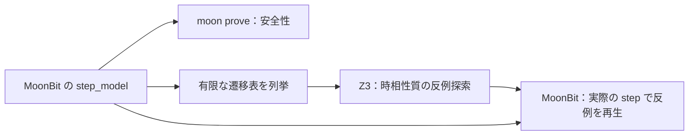

# 時相論理の検査実験

[English](README.md)

リポジトリ直下で `just temporal` を実行する。既存の Z3 だけで動く、単一ジョブの
固定モデルを使うPoCであり、汎用LTLコンパイラや MoonBit 実行時コードの証明ではない。
SAT の具体例を含む結果は `_build/temporal-checks.json` に保存する。

状態は Bool の `pending` と `done`。初期状態は Idle `(false, false)`。
Request は Pending `(true, false)` に進み、Complete は Done `(false, true)` に進む。
完了後を含むすべての状態で、何も変えない遷移（stuttering）を許す。
壊した Drop モデルには、完了せず Pending から Idle に戻る遷移もある。

| 検査 | 期待結果 | 意味 |
| --- | --- | --- |
| 完了への到達 | SAT | 要求して完了できる実行列が存在する |
| 初期状態の安全性・遷移による保存 | UNSAT・UNSAT | `!(pending && done)` を帰納法で保証 |
| 壊した Complete | SAT | pending を消し忘れると安全性を破る |
| `G(pending => F done)`、公平性なし | SAT | `Idle → Pending → Pending → …` |
| 同じ応答性、Complete の弱公平性あり | 深さ4で UNSAT | ちょうど4遷移の違反ループは見つからない |
| 同じ公平性、Drop あり | SAT | `Idle → Pending → Idle → Idle → …` で要求を失う |

安全性は `Init => Safe` と `Safe && Next => Safe'` を個別に検査し、4遷移という
上限なしで帰納的に保証する。一方、活性の検査は状態 `0..4` と `loop ∈ 0..3` を使い、
状態4と状態loopの一致を要求する。このループを永久に繰り返す実行を表す。
応答性の反例には、pending の成立後、その先の区間にもループ内にも done が現れない
ことが必要。有限区間の末尾で未完了というだけでは「いつか完了する」への反例にならない。

ループ上の弱公平性は「Complete が無効な状態がある、または Complete を実行する辺がある」。
このモデルでの正確な実行可能条件は `pending && !done`。
Drop で要求を失えば Complete は永久に無効になれるため、弱公平性でも救えない。
公平性は実際のスケジューラや環境が保証する場合にだけ仮定する。

`tools/temporal.test.mjs` では有限状態の全探索と照合し、SAT の実行列をSMTとは独立に再生する。
結果の `no-counterexample-at-bound` は帰納的な証明と区別する。
時相性質の完全性に十分な探索上限は証明していない。また無限状態の系では、一度も同じ
状態を繰り返さず活性に違反する場合もある。

## 任意の Apalache バックエンド

`just apalache` は **Nix で Apalache 0.62.2 と Java 21 を用意**し、Job と TaskGroup の
計15検査を Z3 と照合する。反例は MoonBit で再生する。通常の MoonBit・Node.js・Z3 に加えて、
flakes が有効な Nix が必要。このバックエンドは任意で、`just verify` には含めない。

```sh
just apalache
just setup-apalache # 導入だけ行い、_build/apalache-bin を作成
_build/apalache-bin/bin/apalache-mc version

# 個別の性質を直接検査する。出力先は _build 以下。
nix run path:./nix -- check --out-dir=_build/apalache/manual \
  --length=8 --temporal=FairResponse checks/temporal/Job.tla
```

[Nix flake](../../nix/flake.nix) で nixpkgs・公式配布物・
[v0.62.2 のリリース](https://github.com/apalache-mc/apalache/releases/tag/v0.62.2)にある SHA-256 を固定した。
システムへの JVM の導入や Docker は不要。Apple Silicon の macOS で動作を確認した。
flake に列挙した他のシステムでは未検証。

`Job.tla` は同じモデルを別途記述したもの。`Safe`、`Response`、`FairResponse`、
`DropNext` を使う `FairResponse` の順に、深さ8まで安全性の違反なし、待機し続ける反例、
深さ8まで公平な応答性の違反なし、要求を失う反例を検査する。
初期変数は Apalache の代入解析に合わせて明示的な代入で定義した。

結果は `_build/apalache/report.json` に保存する。実行ごとに新しいディレクトリへ
TLA+・JSON の遷移表・Z3 の制約・ログ・ITF 形式の反例を出力する。
構文・型エラー、ソルバの unknown、タイムアウト、不正な反例は検査失敗とする。
ループ用の補助変数を解釈する前に Apalache の版を確認し、得た実行列を独立に検査する。
[TaskGroup との接続](../task_group/README.ja.md#apalache-との照合)も参照。

[公式の対応表](https://apalache-mc.org/docs/apalache/features.html)では
`[]`・`<>`・`~>` は対応済み、`ENABLED`・`WF`・`SF` は手動展開が必要とされている。
そのため `Job.tla` は正確なガードから弱公平性を展開し、
`WeakFairComplete => Response` を時相性質として検査する形にしている。
`[]<>` の中のアクションは `<<Complete>>_vars` と書き、状態を変えない遷移を除外する。
[時相検査のチュートリアル](https://apalache-mc.org/docs/tutorials/temporal-properties.html)と
[変換方式の設計](https://apalache-mc.org/docs/adr/017pdr-temporal.html)も参照。

## 現行の moon prove との接続

`just verify-temporal` は、実装済みの
[`examples/temporal`](../../examples/temporal/job.mbt) との接続も検査する。
手元の `moonc v0.10.12+1634b282e` で、通常・機械整数の両モデルとも
本体13件＋利用側2件の証明が通る。



private な `#proof_pure step_model` が実行時と `.mbtp` の補題で共用する遷移定義。
公開 `step` は通常の契約付き関数とし、この定義との正確な対応と `safe_state` の保存を
保証する。`initial`・`enabled`・状態の数値化にも契約を付けた。
公平性に使うガードが実際のアクションの実行可能条件と一致し、状態の符号化と復号が
Bool 2個の全4状態を保存することも証明する。
帰納的な補題と実行可能な `replay` で、任意長の有限なアクション列の安全性を保証する。
別パッケージ `temporal/client` から、普通の `proof_require` / `proof_ensure` で利用できる。

検査したコンパイラでは、別パッケージの契約から `#proof_pure` 関数を直接呼ぶと拒否される。
純粋定義は内部に保ち、通常の契約付き関数と `.mbtp` の述語を公開する形なら通る。
`step` は状態を受け取って新しい状態を返すため、可変状態の `old` にも依存しない。
純粋ヘルパーの仕組みと制約は
[公式の検証ガイド](https://docs.moonbitlang.com/en/latest/language/verification.html#proof-pure)も参照。

`just temporal-bridge` は、実際の MoonBit 関数を4状態×4アクションで実行し、
出力した遷移表から SMT 制約を生成する。深さ1から8まで順にループを探索し、SAT の
反例を MoonBit に戻す。再生側は遷移表を信用せず、アクションをもう一度実行する。
正しい反例2件と、不正な証明書7件を検査する。SMT の変換は独立した全探索と照合し、
1,000件の QuickCheck では標準 shrinking を使って実行列を別の有限モデルと比較する。

証明対象は遷移・安全性・有限実行列の再生・状態の符号化。
JSON の入出力・SMT の生成器・ループの時相評価器は**テスト済みだが未証明**。
公平性はスケジューラへの仮定であり、1回の関数呼び出しの事後条件ではない。
外部の UNSAT を MoonBit の公理として取り込むこともしない。
この例は汎用LTL APIや任意の MoonBit プログラムの自動抽出ではない。
Apalache は別記述の Job 仕様を検査し、その反例を MoonBit が出力した状態へ対応付けて同じ driver で再生する。
