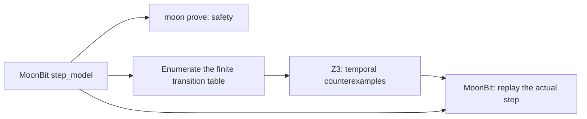

# Temporal checking experiment

[日本語](README.ja.md)

Run `just temporal` from the repository root. This is a fixed single-job model,
not a general LTL compiler or a proof of MoonBit runtime code. Only the existing
Z3 executable is required. Results, including SAT witnesses, are saved in
`_build/temporal-checks.json`.

The two Boolean state variables are `pending` and `done`. The initial state is
idle `(false, false)`. Request changes idle to pending `(true, false)`; Complete
changes pending to done `(false, true)`. Every state can stutter, including the
successful terminal state. The broken Drop variant additionally permits pending
to return to idle without completing the job.

| Check | Expected result | Meaning |
| --- | --- | --- |
| Reachable completion | SAT | A real request/completion trace exists |
| Initial safety and preservation | UNSAT, UNSAT | `!(pending && done)` holds by induction |
| Broken Complete | SAT | Forgetting to clear pending violates safety |
| `G(pending => F done)`, no fairness | SAT | `Idle → Pending → Pending → …` |
| Same response, weak fairness of Complete | UNSAT at bound 4 | No violating lasso of exactly four transitions |
| Same fairness, with Drop | SAT | `Idle → Pending → Idle → Idle → …` loses the request |

Safety uses two independent proof obligations, `Init => Safe` and
`Safe && Next => Safe'`; neither is bounded to four transitions. The liveness
queries instead use states `0..4` and choose `loop` in `0..3`, requiring state 4
to equal state `loop`. This describes an infinite execution by repeating the
loop. A response violation requires a pending state with no done state anywhere
in its remaining suffix or in the loop. A finite, unfinished prefix alone is
not a counterexample to eventual completion.

On a lasso, weak fairness of Complete means that some loop state disables it,
or some loop edge executes it. Its exact enabling predicate in this model is
`pending && !done`. Fairness does not prohibit Drop: once the request is lost,
Complete can remain disabled forever. No fairness assumption should be added
unless the actual scheduler/environment guarantees it.

`tools/temporal.test.mjs` compares the lasso queries with exhaustive exploration
of this finite model and replays each SAT trace independently of the SMT encoding.
The reporter distinguishes `no-counterexample-at-bound` from an inductive proof.
No temporal completeness bound is established here. Infinite-state systems can
also violate liveness without ever repeating a state.

## Optional Apalache backend

`Job.tla` describes the same model separately. These are the intended commands:

```sh
apalache-mc check --length=10 --inv=Safe checks/temporal/Job.tla
apalache-mc check --length=10 --temporal=Response checks/temporal/Job.tla
apalache-mc check --length=10 --temporal=FairResponse checks/temporal/Job.tla
apalache-mc check --length=10 --next=DropNext --temporal=FairResponse checks/temporal/Job.tla
```

Expected outcomes are: no safety violation, a liveness counterexample, no liveness
counterexample within the bound, and a dropped-request counterexample. Apalache
was **not executed** in this environment: it has no JVM or running Docker daemon.
The TLA+ example and the commands are therefore not yet validated with Apalache.

The [supported-features list](https://apalache-mc.org/docs/apalache/features.html)
supports `[]`, `<>` and `~>`, but requires manual expansion of `ENABLED`, `WF` and
`SF`. Accordingly, `Job.tla` expands weak fairness using the exact guard and
checks `WeakFairComplete => Response` as a temporal property. See the
[temporal tutorial](https://apalache-mc.org/docs/tutorials/temporal-properties.html)
and [temporal encoding design](https://apalache-mc.org/docs/adr/017pdr-temporal.html).

## Connection to current `moon prove`

`just verify-temporal` also checks the implemented bridge in
[`examples/temporal`](../../examples/temporal/job.mbt). The installed
`moonc v0.10.12+1634b282e` proves the model and client under both normal and machine
integers (13 + 2 goals per prelude).



The private `#proof_pure step_model` is the single executable transition
definition and is also available to `.mbtp` lemmas. The public `step` is a normal
contracted function: it guarantees exact correspondence with that definition and
preserves `safe_state`. `initial`, `enabled`, and the state-code conversion
functions also have proved contracts. The guard is proved to describe actual
action availability; the encoding roundtrip preserves all four Boolean states.
An inductive trace lemma and the executable `replay` function establish safety
for arbitrary finite action lists. The separate `temporal/client` package
demonstrates ordinary `proof_require` / `proof_ensure` consumers.

In the tested compiler, directly importing `#proof_pure` calls into a different
package's contracts is rejected. Keeping pure definitions private and exporting
contracted functions plus `.mbtp` predicates works. This also avoids relying on
mutable old-state snapshots: `step` takes a state and returns a new state.
The [official verification guide](https://docs.moonbitlang.com/en/latest/language/verification.html#proof-pure)
describes the pure-helper mechanism and its current restrictions.

`just temporal-bridge` executes the actual MoonBit function for all four states
and four actions, then creates SMT queries from the exported table. It searches
every lasso length from 1 through 8 and sends SAT witnesses back to MoonBit. The
driver executes each action again rather than trusting the table. Two valid
counterexamples and seven invalid certificates are checked. Independent explicit
search checks the SMT encoding, and 1,000 QuickCheck action traces use standard
shrinking to compare executable replay with a separate finite reference.

The proof covers the transition, safety, finite replay, and state encoding. The
JSON exporter/parser, SMT generator, and lasso evaluator are **tested, not
formally proved**. Fairness is a scheduling assumption, not a postcondition of
one call. No external UNSAT result is imported as a MoonBit axiom. This finite
example does not implement a general LTL API or automatic extraction of arbitrary
MoonBit programs; Apalache remains optional and unexecuted as noted above.
